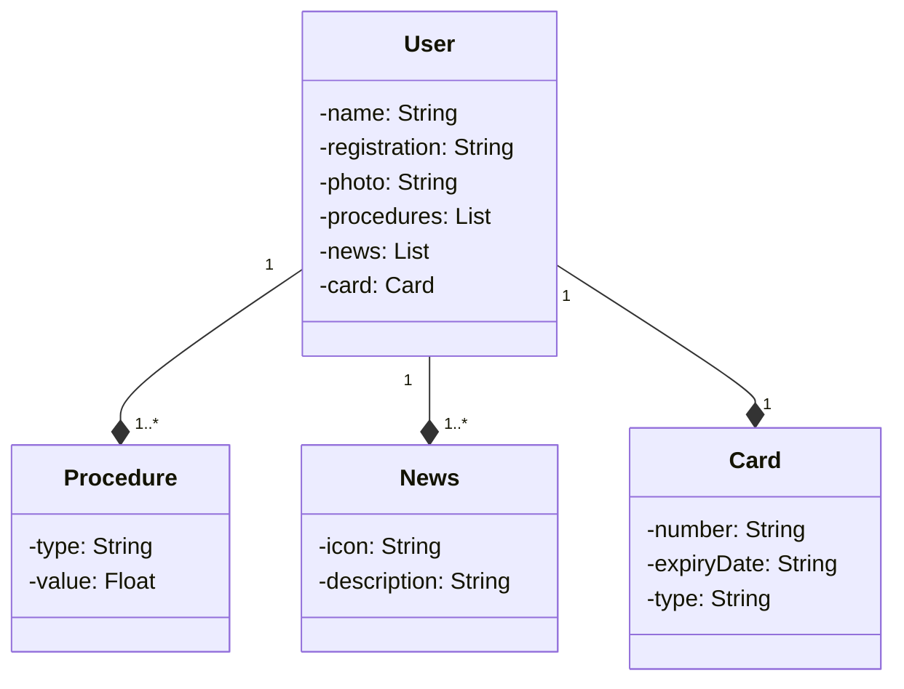

<h1 align="center">
  🖥️ 💡 DESAFIO API Rest no domínio de uma clínica odontológica
</h1>

 <p align="center">
   
   
   
   
   
 
 
 
 </p>

 ## 🚩 Tecnologias

 Esse projeto foi desenvolvido com as seguintes tecnologias:

- Java 17: Utilizei a versão LTS mais recente do Java;
- Spring Boot 3: Trabalhei com a mais nova versão do Spring Boot;
- Spring Data JPA: Simplifiquei a camada de acesso aos dados, facilitando a integração com bancos de dados SQL;
- OpenAPI (Swagger): Criei uma documentação de API eficaz e fácil de entender usando a OpenAPI (Swagger);
- Railway: Fiz o deploy e monitoramento das soluções na nuvem.

## 🧮 Projeto

Esse projeto foi desenvolvido com base no curso **Santander Bootcamp 2023 - Backend Java** da **DIO.me**. Esta aplicação consiste em exercitar conceitos vistos no projeto proposto de criação de uma API REST na Nuvem usando Spring Boot 3, Java 17 e Railway.

## Domínio da API
### Figma

O Figma foi utilizado para a abstração do domínio desta API, sendo útil na análise e projeto da solução.

Veja o modelo que criei:


### Diagrama de classes

## 👨🏾‍💻 Instalação 
1. Para iniciar o desenvolvimento, é necessário clonar o projeto do GitHub num diretório de sua preferência:

```shell
cd "diretorio de sua preferencia"
git clone https://github.com/vinisantosn/api-rest-clinicasoridente
```

2. Abra um terminal e execute a `main`;

## Exemplo de um POST
```
{
  "id": 1,
  "name": "Vinícius Santos",
  "registration": "001VS",
  "photo": "URL_DEFAULT_ICON",
  "procedures": [
    {
      "id": 1,
      "type": "Clareamento dental",
      "value": 785.99
    }
  ],
  "news": [
    {
      "id": 1,
      "icon": "moon-icon",
      "description": "A relevância da higiennização antes de dormir"
    },
    {
      "id": 2,
      "icon": "clock-icon",
      "description": "Por que não escovar os dentes logo apos as refeições?"
    }
  ],
  "card": {
    "id": 1,
    "number": "46489211452",
    "expiryDate": "2023-10-15T18:48:18.717Z",
    "type": "premium"
  }
}
```
 

## 🖼️ Imagens
|  Resultado  |
|  ---  |
||

## 🙋🏾‍♂️ Contribuições

Deem uma olhada na [API](https://api-rest-clinicasoridente-prd.up.railway.app/swagger-ui/index.html) e faça suas contriuições ou apontamentos.

Contribuições são sempre bem-vindas! 

## 💼 Licença
Não se aplica
